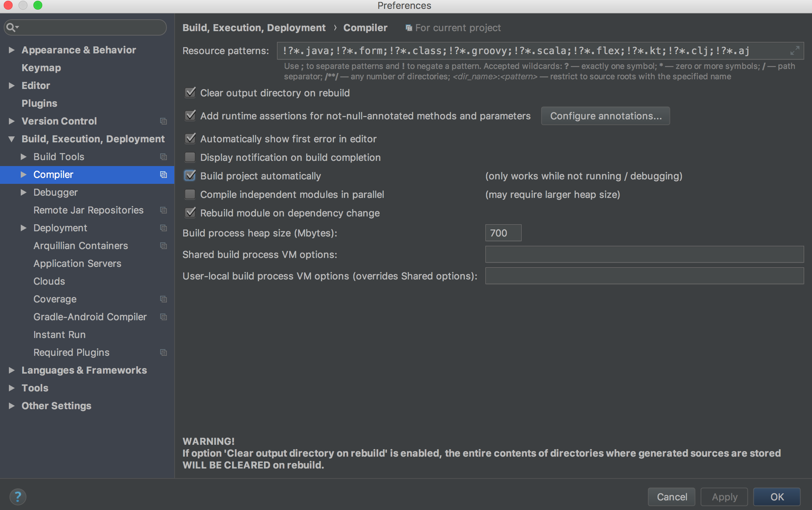
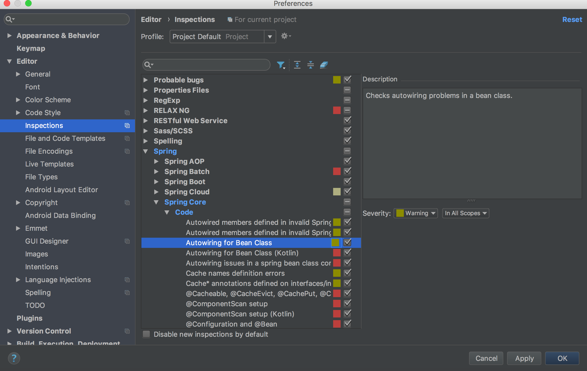

# mall-init

## 第4章 项目初始化
[返回主目录](../README.md)

### 4.1 mybatis三剑客
    mybatis-generator
    mybatis-plugin
    mybatis-pagehelper
[mybatis三剑客.doc](src/main/resources/doc/mybatis三剑客.doc)
 
### 4.2 spring官方demo
SpringBoot Demo：https://github.com/spring-projects/spring-boot/tree/master/spring-boot-samples

SpringBoot MVC Demo：https://github.com/spring-projects/spring-petclinic

Spring MVC Demo：https://github.com/spring-projects/spring-mvc-showcase

 ### 4.3 idea的注入和自动编译配置
 
 
 
 
 ### 4.4 两个提高工作效率的神器
     Restlet Client
     fe助手
     
### 4.5 项目搭建文档
[readme.docx](src/main/resources/doc/readme.docx)