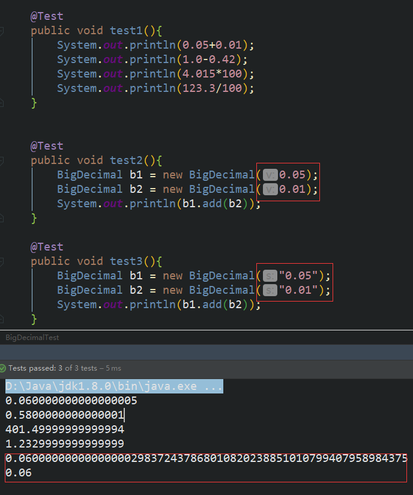
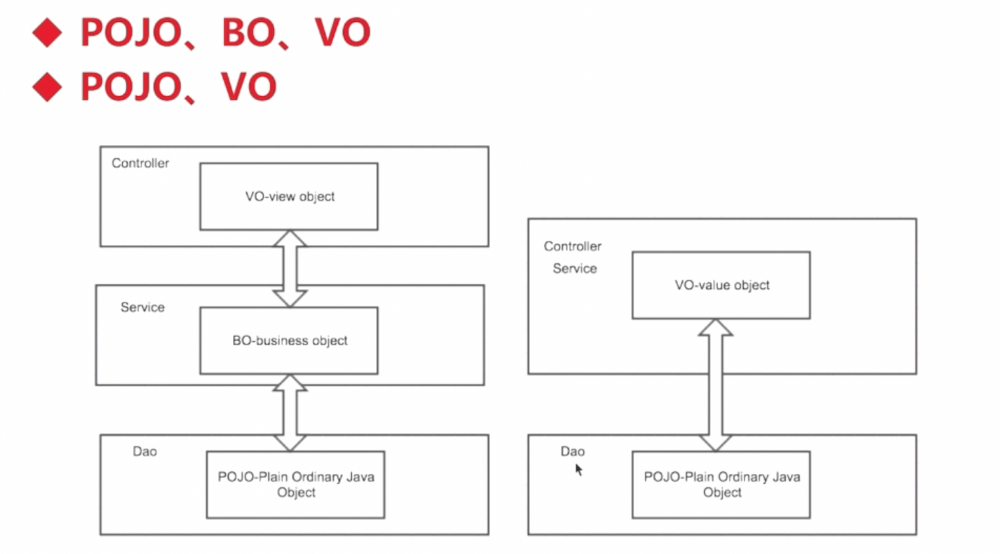
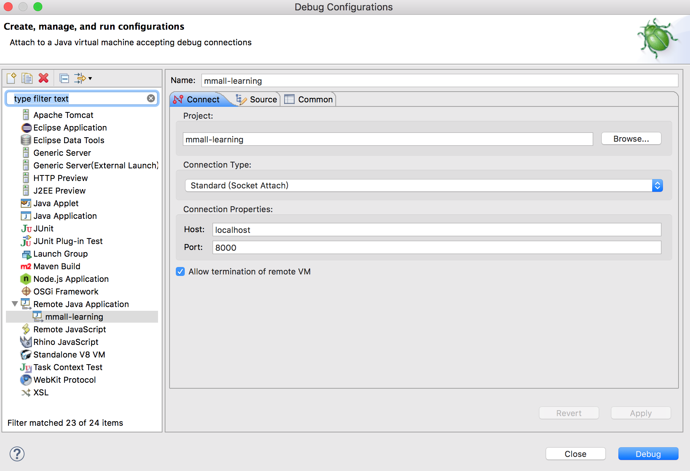
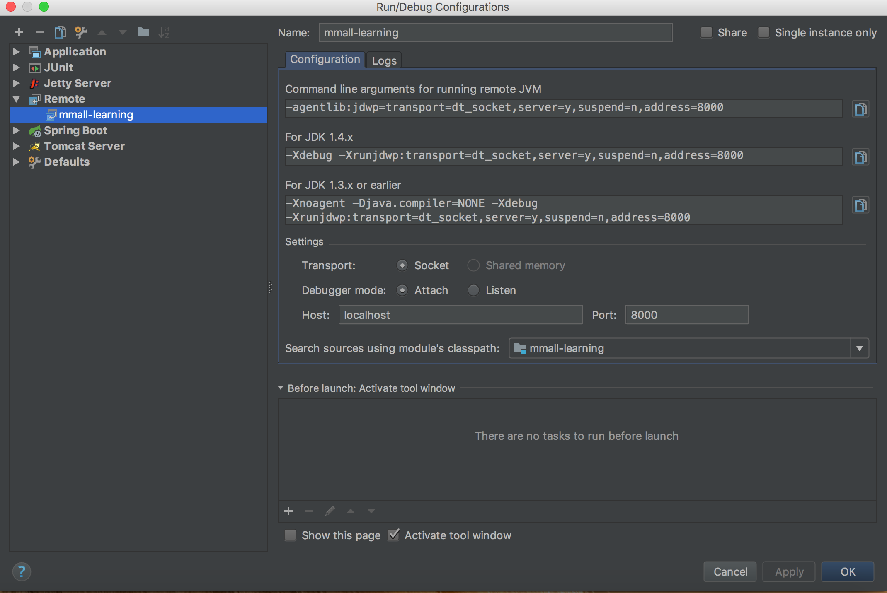

# mmall-learning

## 项目优化

1.数据库连接池用Druid

    不解释
2.Spring分模块配置

    spring-context-dao.xml
    spring-context-service.xml
    spring-context-web.xml

在web.xml配置如下：
```xml
    <!-- Spring DispatcherServlet -->
    <servlet>
        <servlet-name>mmall-learning-dispatcher</servlet-name>
        <servlet-class>org.springframework.web.servlet.DispatcherServlet</servlet-class>
        <init-param>
            <param-name>contextConfigLocation</param-name>
            <param-value>classpath:spring/spring-context*.xml</param-value>
        </init-param>
    </servlet>
    <servlet-mapping>
        <servlet-name>mmall-learning-dispatcher</servlet-name>
        <url-pattern>/</url-pattern>
    </servlet-mapping>
```

3.结果响应侵入太严重，用切面

```java
package com.mmall.common.response;

import java.io.Serializable;

/**
 * 统一返回值类
 * @author 杜洪明
 * @creation 2018年10月10日
 */
public class ResultBean<T> implements Serializable{

		private static final long serialVersionUID = 1L;
		
		/**
		 * 成功标识  
		 */
		public static final int SUCCESS = 0;
		/**
		 * 失败标识  
		 */
		public static final int FAIL = 1;
		/**
		 * 没有权限  
		 */
		public static final int NO_PERMISSION = 2;
		/**
		 * 输出消息  
		 */
		private String msg = "success";
		/**
		 * 输出状态  
		 */
		private int code = SUCCESS;
		/**
		 * 输出JavaBean  
		 */
		private T data;

		public ResultBean() {
			super();
		}

		public ResultBean(T data) {
			super();
			this.data = data;
		}

		public ResultBean(Throwable e) {
			super();
			this.msg = e.toString();
			this.code = FAIL;
		}


		public String getMsg() {
			return msg;
		}

		public void setMsg(String msg) {
			this.msg = msg;
		}

		public int getCode() {
			return code;
		}

		public void setCode(int code) {
			this.code = code;
		}

		public T getData() {
			return data;
		}

		public void setData(T data) {
			this.data = data;
		}
}

```
```java
package com.mmall.common.response;


import com.google.gson.GsonBuilder;
import com.mmall.common.exception.CommonException;
import org.aspectj.lang.ProceedingJoinPoint;
import org.aspectj.lang.annotation.AfterReturning;
import org.aspectj.lang.annotation.Around;
import org.aspectj.lang.annotation.Aspect;
import org.aspectj.lang.annotation.Pointcut;
import org.slf4j.Logger;
import org.slf4j.LoggerFactory;
import org.springframework.stereotype.Component;
import org.springframework.web.context.request.RequestContextHolder;
import org.springframework.web.context.request.ServletRequestAttributes;

import javax.servlet.http.HttpServletRequest;
import java.io.IOException;
import java.util.Arrays;

/**
 *  该类为aop切面类，主要是对所有返回值为resultbean的方法进行入参监控，以及异常处理
 * @author 杜洪明
 * @creation 2018年10月10日
 */
@Aspect
@Component
public class ControllerAOP {
	private static final Logger logger = LoggerFactory.getLogger(ControllerAOP.class);

	@Pointcut("execution(public com.mmall.common.response.ResultBean *(..))")
	public void webLog() {
	}

	@Around("webLog()")
	/**
	 * 对返回值为resultbean的方法进行切面，获取其入参
	 * @param pjp
	 * @return
	 */
	public Object handlerControllerMethod(ProceedingJoinPoint pjp) {

		long startTime = System.currentTimeMillis();
		ResultBean<?> result;
		try {
			result = (ResultBean<?>) pjp.proceed();
			logger.info(pjp.getSignature() + "use time:" + (System.currentTimeMillis() - startTime));
			// 接收到请求，记录请求内容
			ServletRequestAttributes attributes = (ServletRequestAttributes) RequestContextHolder
					.getRequestAttributes();
			HttpServletRequest request = attributes.getRequest();
			// 记录下请求内容
			logger.info("URL : " + request.getRequestURL().toString());
			logger.info("HTTP_METHOD : " + request.getMethod());
			logger.info("IP : " + request.getRemoteAddr());
			logger.info("CLASS_METHOD : " + pjp.getSignature().getDeclaringTypeName() + "." + pjp.getSignature().getName());
			logger.info("ARGS : " + Arrays.toString(pjp.getArgs()));
		} catch (Throwable e) {
			result = handlerException(pjp, e);
		}
		return result;

	}
    
	@AfterReturning(returning = "ret", pointcut = "webLog()")
	/**
	 * 对切面方法进行返回值处理
	 * @param ret
	 * @throws Throwable
	 */
	public void doAfterReturning(Object ret) throws Throwable {
		// 处理完请求，返回内容
		logger.info("RESPONSE : " + new GsonBuilder().create().toJson(ret));
	}

	@SuppressWarnings("rawtypes")
	/**
	 * 对切面方法进行异常捕获处理
	 * @param pjp
	 * @param e
	 * @return
	 */
	private ResultBean<?> handlerException(ProceedingJoinPoint pjp, Throwable e) {

		ResultBean<?> result = new ResultBean();
		// 已知异常
		if(e instanceof IllegalStateException) {
			result.setMsg(e.getLocalizedMessage()+"非法文件格式");
			result.setCode(ResultBean.FAIL);
		} else if (e instanceof IOException) {
			result.setMsg(e.getLocalizedMessage()+"找不到文件夹");
			result.setCode(ResultBean.FAIL);
		}
		else if(e instanceof CommonException){}{
			logger.error(pjp.getSignature() + " exception ", e);
			CommonException commonException = (CommonException)e;
			result.setCode(commonException.getErrorCode());
			result.setMsg(commonException.getErrorInfo());
			// 未知异常是应该重点关注的，这里可以做其他操作，如通知邮件，单独写到某个文件等等。
		}
		return result;

	}

}
```
4.异常定义散落太严重，用枚举
```java
package com.mmall.common.exception;

/**
 * @Author duhongming
 * @Email 19919902414@189.cn
 * @Date 2018/8/31 15:16
 */
public class CommonException extends RuntimeException {

    protected int errorCode;
    protected String errorInfo;

    public CommonException(int errorCode,String errorInfo){
        this.errorCode=errorCode;
        this.errorInfo=errorInfo;
    }

    @Override
    public String toString() {
        return "CommonException{" +
                "errorCode=" + errorCode +
                ", errorInfo='" + errorInfo + '\'' +
                '}';
    }

    public int getErrorCode() {
        return errorCode;
    }

    public void setErrorCode(int errorCode) {
        this.errorCode = errorCode;
    }

    public String getErrorInfo() {
        return errorInfo;
    }

    public void setErrorInfo(String errorInfo) {
        this.errorInfo = errorInfo;
    }
}
```
```java
package com.mmall.common.exception;

/**
 * @Author duhongming
 * @Email 19919902414@189.cn
 * @Date 2018/8/31 15:45
 */
public class CommonExceptions {

    public enum UserCommonException{

        USER_NAME_NOT_EXIST(new CommonException(1000,"用户名不存在！")),
        USER_NAME_EXISTED(new CommonException(1001,"用户名已存在！")),
        EMAIl_EXISTED(new CommonException(1002,"邮箱已存在！")),

        PASSWORD_ERROR(new CommonException(1101,"密码错误！")),
        PARAMETER_ERROR(new CommonException(1102,"参数错误！")),

        USER_NOT_LOGIN(new CommonException(1201,"用户未登录！"));


        private CommonException commonException;

        UserCommonException(CommonException commonException){
            this.commonException = commonException;
        }

        public CommonException getCommonException() {
            return commonException;
        }

        public void setCommonException(CommonException commonException) {
            this.commonException = commonException;
        }

        public static void show(){
            for(UserCommonException u : UserCommonException.values()){
                System.out.println(u + "： UserCommonException =" + u.getCommonException());
            }
        }
    }

}
```
5.缺少异常码表
    
    同上
    
6.递归查找所有子节点

    递归遍历并且查数据库，性能极差以及非常危险

6.1 新增parent_ids
 

6.2 JAVA程序
```java
    private static final String SUFFIX_CHAT = ".";
    private Category createParentIds(Category category) {
        Integer parentId = category.getParentId();
        if (parentId == null || parentId == 0) {
            category.setParentIds(String.valueOf(0));
        } else {
            Category currentCategory = categoryMapper.selectByPrimaryKey(parentId);
            category.setParentIds(currentCategory.getParentIds() + SUFFIX_CHAT + parentId);
        }
        return category;
    }
```
6.3 SQL查询   
```sql
    select
      id
    from mmall_category
    where parent_ids like CONCAT(#{parentIds,jdbcType=VARCHAR},'.',#{id,jdbcType=INTEGER},'%')
```
    
## 项目总结
1.@RequestParam注解使用

    父节点默认值：    
    @RequestParam(value = "parentId", defaultValue = "0") int parentId
    图片上传字段修改：
    @RequestParam(value = "upload_file", required = false) MultipartFile file
    分页参数默认值：
    @RequestParam(value = "pageNum", defaultValue = "1") int pageNum,
    @RequestParam(value = "pageSize", defaultValue = "10") int pageSize

2.Mybatis的where标签

```xml
    <where>
      <if test="productName != null">
        and name like #{productName}
      </if>
      <if test="productId != null">
        and id = #{productId}
      </if>
    </where>
```

3.商业计算一定要用BigDecimal的String构造器


```java
    System.out.println(0.05+0.01);
    System.out.println(1.0-0.42);
    System.out.println(4.015*100);
    System.out.println(123.3/100);
```
    
4.用逗号，切割字符串，并转化成List
```java
    //Splitter.on：用逗号，切割字符串，并转化成List
    List<String> productList = Splitter.on(",").splitToList(productIds);
```

5.安全漏洞防范

横向越权：攻击者尝试访问与他拥有相同权限的用户的资源

纵向越权：低级别攻击者尝试访问高级别用户的资源

6.Java Object


7.java远程debug调试tomcat

    window系统，在catalina.bat里： 
    SET CATALINA_OPTS=-server -Xdebug -Xnoagent -Djava.compiler=NONE -Xrunjdwp:transport=dt_socket,server=y,suspend=n,address=8000
    
    Linux系统，在catalina.sh里： 
    CATALINA_OPTS="-server -Xdebug -Xnoagent -Djava.compiler=NONE -Xrunjdwp:transport=dt_socket,server=y,suspend=n,address=8000"
RemoteDebugEclipse:

RemoteDebugIDEA:



