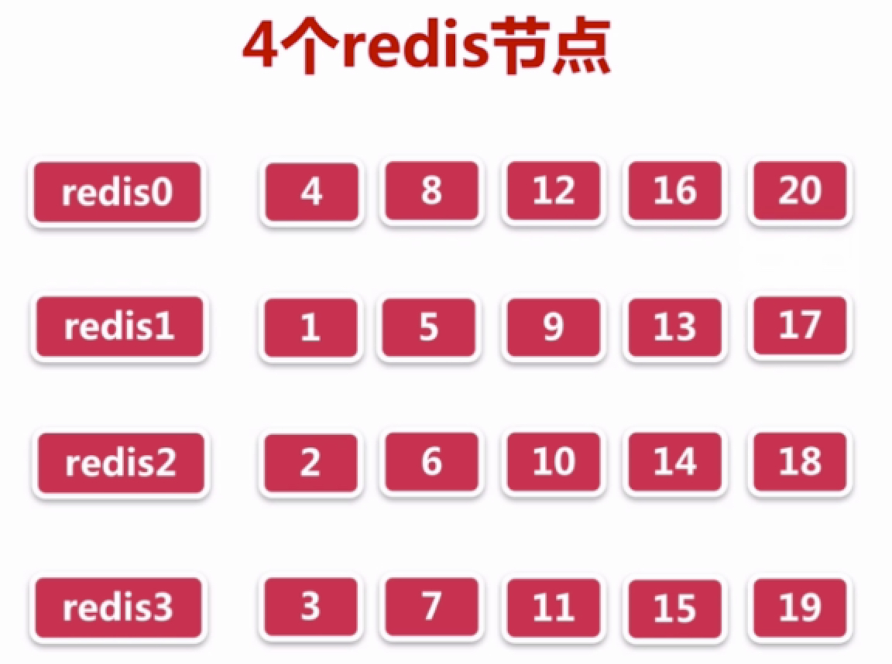
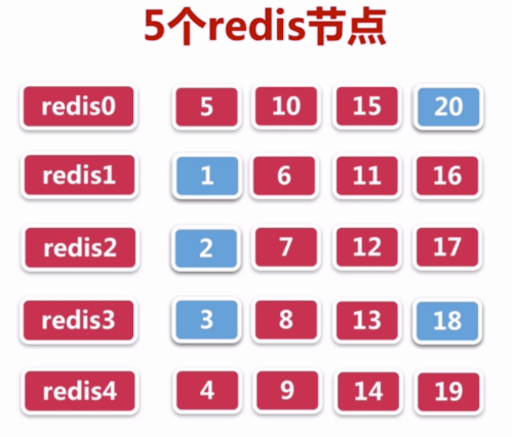
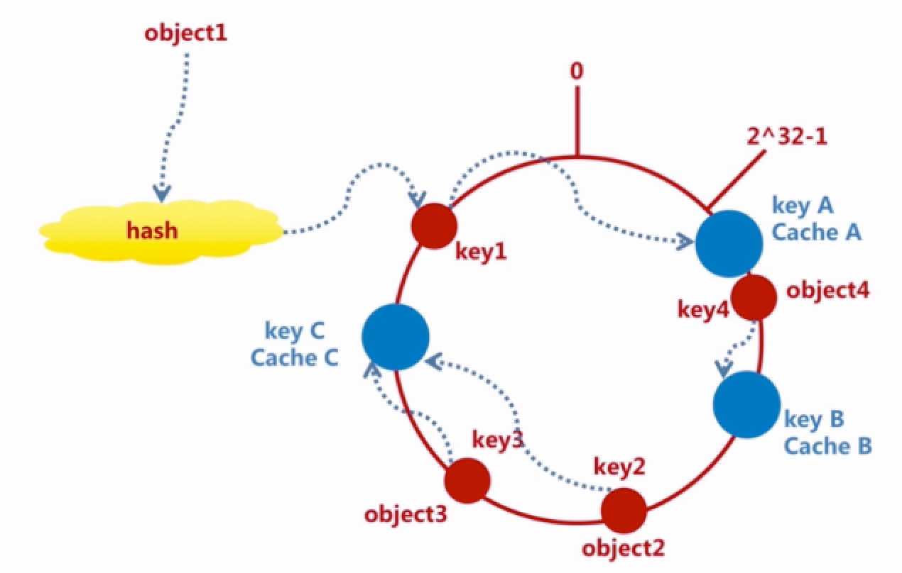
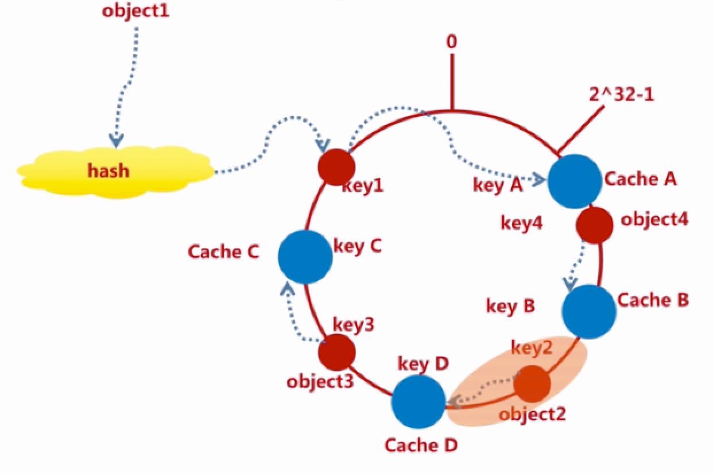
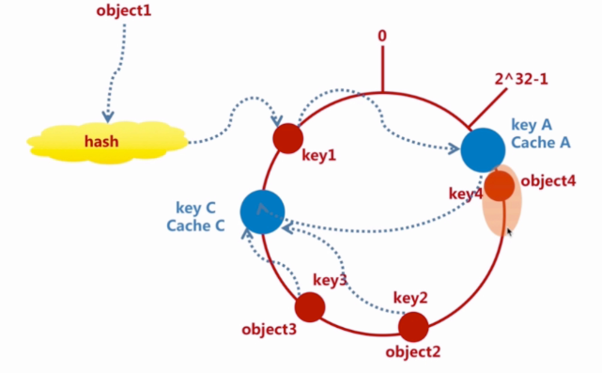
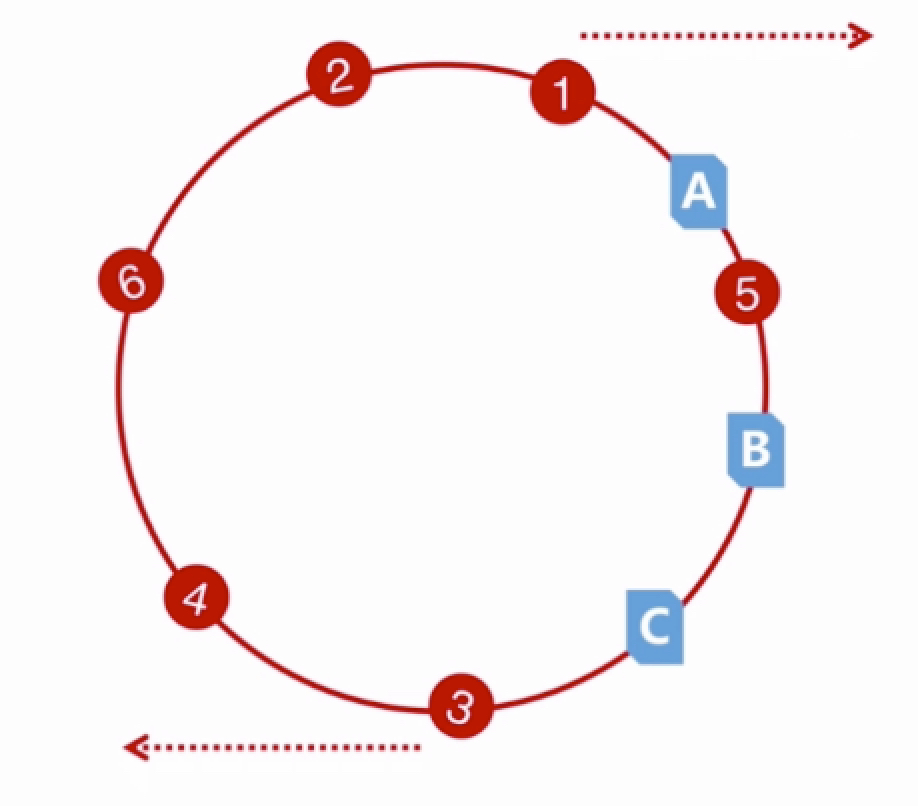
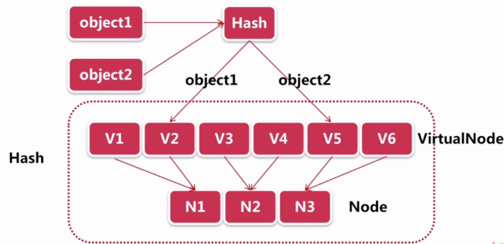

# 第7章 Redis分布式算法原理、分布式连接池实战及验证

## 7.1 传统分布式算法

当增加一个redis节点后，命中率为5/20=25%

## 7.2 Consistent Hash一致性算法原理
key1-object1(key-value键值对)顺时针保存到就近的KeyA-Cache A（服务器节点）中。

增加节点影响范围（逆时针）：

删除节点影响范围（逆时针）：

## 7.3 Hash倾斜性
B上没有任何数据节点：

## 7.4 通过虚拟节点解决Hash倾斜性
