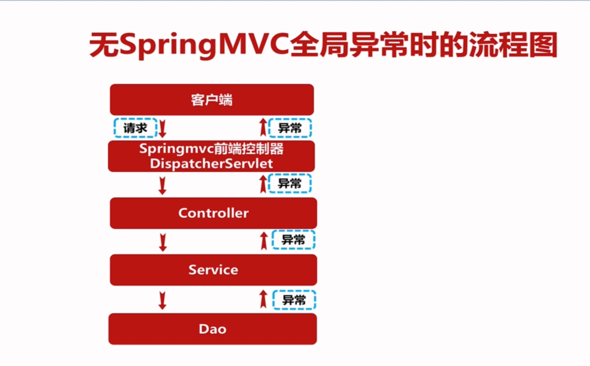
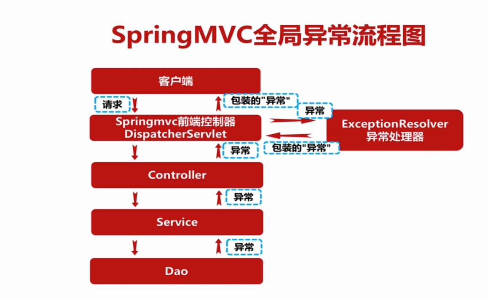

# 第9章 SpringMVC全局异常处理

## 9.1 无SpringMVC全局异常时的流程图


## 9.2 无SpringMVC全局异常时的流程图


## 9.3 实现

jackson1:
```xml
<org.springframework.version>4.0.3.RELEASE</org.springframework.version>
<dependency>
  <groupId>org.codehaus.jackson</groupId>
  <artifactId>jackson-mapper-asl</artifactId>
  <version>1.9.12</version>
</dependency>
```

jackson2:
```xml
<org.springframework.version>4.3.9.RELEASE</org.springframework.version>
<jackson.version>2.7.4</jackson.version><!-- jackson json -->
<dependency>
  <groupId>com.fasterxml.jackson.core</groupId>
  <artifactId>jackson-core</artifactId>
  <version>${jackson.version}</version>
</dependency>
<dependency>
  <groupId>com.fasterxml.jackson.core</groupId>
  <artifactId>jackson-databind</artifactId>
  <version>${jackson.version}</version>
</dependency>
<dependency>
  <groupId>com.fasterxml.jackson.core</groupId>
  <artifactId>jackson-annotations</artifactId>
  <version>${jackson.version}</version>
</dependency>
<dependency>
  <groupId>com.fasterxml.jackson.module</groupId>
  <artifactId>jackson-module-jaxb-annotations</artifactId>
  <version>${jackson.version}</version>
</dependency>

```

```java
@Component
public class ExceptionResolver implements HandlerExceptionResolver {

    private Logger logger = LoggerFactory.getLogger(ExceptionResolver.class);


    @Override
    public ModelAndView resolveException(HttpServletRequest request, HttpServletResponse response, Object handler, Exception ex) {
        logger.error(request.getRequestURI() + " Exception：", ex);
        //jackson1
//        ModelAndView modelAndView = new ModelAndView(new MappingJacksonJsonView());
//        ModelAndView modelAndView = new ModelAndView();
        //jackson2
        ModelAndView modelAndView = new ModelAndView(new MappingJackson2JsonView());
        modelAndView.addObject("status", ResultBean.FAIL);
        modelAndView.addObject("msg", "接口异常,详情请查看日志中的异常信息");
        modelAndView.addObject("data",ex.toString());
        return modelAndView;
    }
}
```

