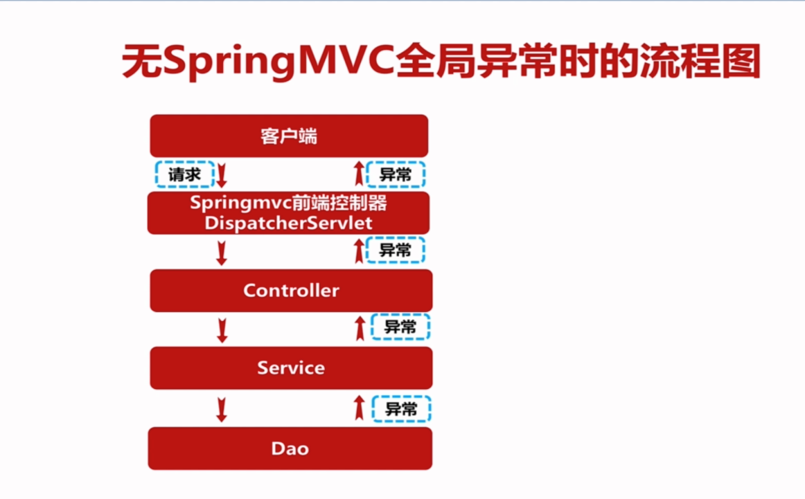
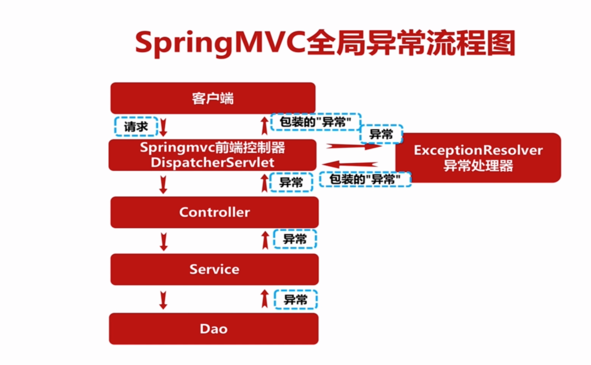

# 第9章 SpringMVC全局异常处理

## 9.1 无SpringMVC全局异常时的流程图


## 9.2 无SpringMVC全局异常时的流程图


## 9.3 实现

jackson1:
```xml
<org.springframework.version>4.0.3.RELEASE</org.springframework.version>
<dependency>
  <groupId>org.codehaus.jackson</groupId>
  <artifactId>jackson-mapper-asl</artifactId>
  <version>1.9.12</version>
</dependency>
```

jackson2:
```xml
<org.springframework.version>4.3.9.RELEASE</org.springframework.version>
<jackson.version>2.7.4</jackson.version><!-- jackson json -->
<dependency>
  <groupId>com.fasterxml.jackson.core</groupId>
  <artifactId>jackson-core</artifactId>
  <version>${jackson.version}</version>
</dependency>
<dependency>
  <groupId>com.fasterxml.jackson.core</groupId>
  <artifactId>jackson-databind</artifactId>
  <version>${jackson.version}</version>
</dependency>
<dependency>
  <groupId>com.fasterxml.jackson.core</groupId>
  <artifactId>jackson-annotations</artifactId>
  <version>${jackson.version}</version>
</dependency>
<dependency>
  <groupId>com.fasterxml.jackson.module</groupId>
  <artifactId>jackson-module-jaxb-annotations</artifactId>
  <version>${jackson.version}</version>
</dependency>

```

```java
@Component
public class ExceptionResolver implements HandlerExceptionResolver {

    private Logger logger = LoggerFactory.getLogger(ExceptionResolver.class);


    @Override
    public ModelAndView resolveException(HttpServletRequest request, HttpServletResponse response, Object handler, Exception ex) {
        logger.error(request.getRequestURI() + " Exception：", ex);
        //jackson1
//        ModelAndView modelAndView = new ModelAndView(new MappingJacksonJsonView());
//        ModelAndView modelAndView = new ModelAndView();
        //jackson2
        ModelAndView modelAndView = new ModelAndView(new MappingJackson2JsonView());
        modelAndView.addObject("status", ResultBean.FAIL);
        modelAndView.addObject("msg", "接口异常,详情请查看日志中的异常信息");
        modelAndView.addObject("data",ex.toString());
        return modelAndView;
    }
}
```

# 第10章 SpringMVC拦截器实现权限统一校验
## 10.1 实现
```xml
<mvc:interceptors>
    <!-- 定义在这里是所有的都会拦截 -->
    <mvc:interceptor>
        <!-- 定义在这里会拦截指定的请求url -->
        <mvc:mapping path="/manage/**"/>
        <mvc:exclude-mapping path="/manage/user/login.do"/>
        <bean class="com.mmall.controller.common.interceptor.AuthorityInterceptor"/>
    </mvc:interceptor>
</mvc:interceptors>
```
```java
public class AuthorityInterceptor implements HandlerInterceptor {

	private Logger logger = LoggerFactory.getLogger(AuthorityInterceptor.class);

	@Override
	public boolean preHandle(HttpServletRequest request, HttpServletResponse response, Object handler) throws Exception {
		//请求controller中的方法名

		HandlerMethod handlerMethod = (HandlerMethod)handler;

		//解析HandlerMethod

		String methodName = handlerMethod.getMethod().getName();
		String className = handlerMethod.getBean().getClass().getSimpleName();

		
		StringBuffer requestParamBuffer = new StringBuffer();
		Map paramMap = request.getParameterMap();
		Iterator it = paramMap.entrySet().iterator();
		while (it.hasNext()) {
			Map.Entry entry = (Map.Entry) it.next();
			String mapKey = (String) entry.getKey();
			String mapValue = "";
			
			//request的这个参数map的value返回的是一个String[]
			Object obj = entry.getValue();
			if (obj instanceof String[]){
				String[] strs = (String[])obj;
				mapValue = Arrays.toString(strs);
			}
			requestParamBuffer.append(mapKey).append("=").append(mapValue);
		}

		//对于拦截器中拦截manage下的login.do的处理,对于登录不拦截，直接放行
		if(StringUtils.equals(className,"UserManageController") && StringUtils.equals(methodName,"login")){
			logger.info("权限拦截器拦截到请求,className:{},methodName:{}",className,methodName);//如果是拦截到登录请求，不打印参数，因为参数里面有密码，全部会打印到日志中，防止日志泄露
			return true;
		}

		logger.info("权限拦截器拦截到请求,className:{},methodName:{},param:{}",className,methodName,requestParamBuffer);

		User user = (User)request.getSession().getAttribute(Const.CURRENT_USER);

		if (user == null) {
			throw CommonExceptions.UserCommonException.USER_NOT_LOGIN.getCommonException();
		}

//		User user = null;
//		String loginToken  = CookieUtil.readLoginToken(request);
//		if(StringUtils.isNotEmpty(loginToken)){
//			String userJsonStr = redisPoolUtil.get(loginToken);
//			user = JSON.parseObject(userJsonStr, User.class);
//		}

		if(user == null || (user.getRole().intValue() != Const.Role.ROLE_ADMIN)){
			//返回false.即不会调用到controller里的方法
			response.reset();//geelynote 这里要添加reset，否则报异常 getWriter() has already been called for this response
			response.setCharacterEncoding("UTF-8");//geelynote 这里要设置编码，否则会乱码
//			response.setContentType("text/html;charset=utf-8");
			response.setContentType("application/json;charset=UTF-8");//geelynote 这里要设置返回值类型，因为全部是json接口。

			PrintWriter out = response.getWriter();


			//上传由于富文本的控件要求，要特殊处理返回值，这里面区分是否登录以及是否有权限
			if(user == null){
				if(StringUtils.equals(className,"ProductManageController") && (StringUtils.equals(methodName,"richtextImgUpload") )){
					Map resultMap = Maps.newHashMap();
					resultMap.put("success",false);
					resultMap.put("msg","请登录管理员");
					out.print(JSON.toJSONString(resultMap));
				}else{
					out.print(JSON.toJSONString(new ResultBean<>("拦截器拦截,用户未登录")));
				}

			}else{
				if(StringUtils.equals(className,"ProductManageController") && (StringUtils.equals(methodName,"richtextImgUpload") )){
					Map resultMap = Maps.newHashMap();
					resultMap.put("success",false);
					resultMap.put("msg","无权限操作");
					out.print(JSON.toJSONString(resultMap));

				}else{
					out.print(JSON.toJSONString(new ResultBean<>("拦截器拦截,用户无权限操作")));
				}
			}

			out.flush();//geelynote 这里要关闭流
			out.close();

			//geelynote
			return false;//这里虽然已经输出，但是还会走到controller，所以要return false
		}
		return true;
	}


	@Override
	public void postHandle(HttpServletRequest request, HttpServletResponse response, Object handler, ModelAndView modelAndView) throws Exception {
		System.out.println("postHandle");
	}

	@Override
	public void afterCompletion(HttpServletRequest request, HttpServletResponse response, Object handler, Exception ex) throws Exception {
		System.out.println("afterCompletion");
	}

}

```

# 第11章 SpringMVC RESTful原理及改造实战
@PathVariable
PUT操作：需要在header中声明Content-Type:application/x-www-form-urlencoded
